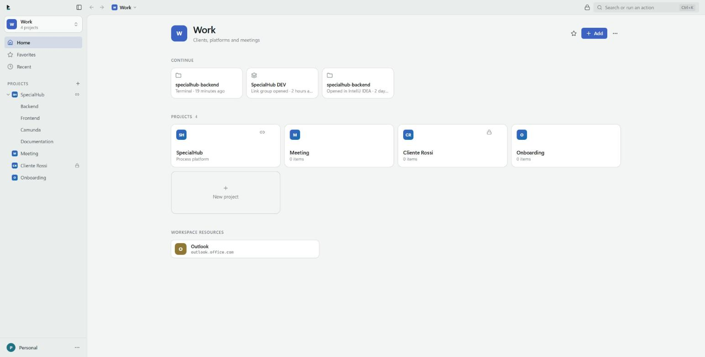
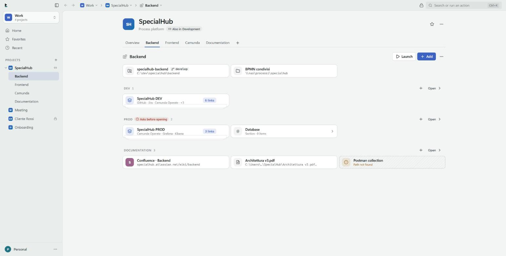
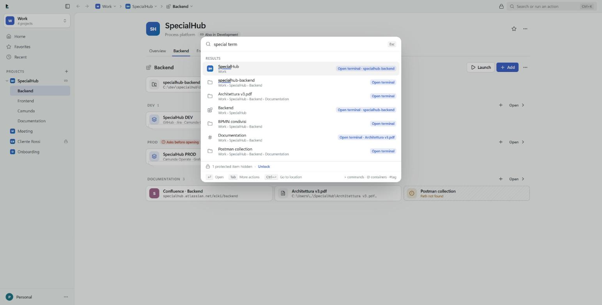
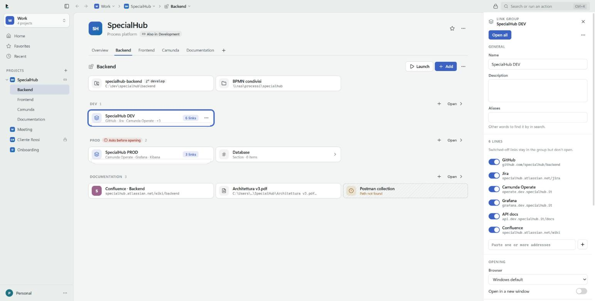
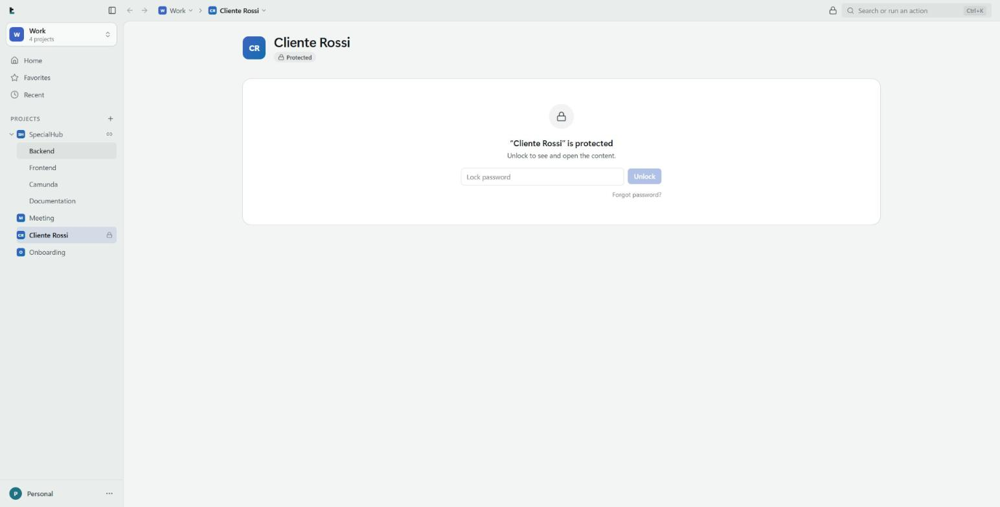
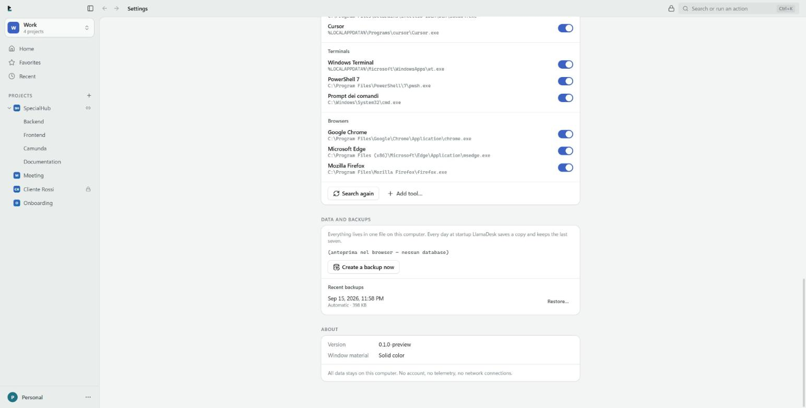

<div align="center">


# LlamaDesk

### Open your project, not your bookmarks.

A local-first launcher and workspace manager for Windows: it keeps the links, files, folders and
repositories of a project together, and opens each of them with the right tool.

[](LICENSE)
[](../../releases)


[Download](../../releases) · [Documentation](docs/README.md) ·
[Getting started](docs/GETTING_STARTED.md) · [Issues](../../issues)



</div>

---

## What it is

LlamaDesk is a desktop application that holds the **context of a project**: its links, its web
consoles, its local folders, its Git repositories — and the tools those things open with.

Instead of a bookmark bar, a folder of shortcuts and a terminal history, you get one place where
a project says: *this repository opens in IntelliJ, this group of links opens in the work profile
of Chrome, this folder opens in Windows Terminal.* One click, or one search.

Everything is local: one SQLite file in your user folder, no account, no cloud, no telemetry. The
Rust side of the app contains no HTTP client at all, and the build fails if one is ever added.

## The problem it solves

A single working day is spread across a repository, a Jira board, three Camunda consoles, a
shared folder and two browser profiles. Three things go wrong:

- **Scattering** — the same project lives in bookmarks, in Explorer, in the terminal history and
  in your head.
- **Wrong tool, wrong place** — the link opens in the personal browser profile; the repository
  opens in the wrong editor.
- **The expensive mistake** — the production console opens when you meant the test one.

LlamaDesk answers with a hierarchy that matches how work is actually organised, a tool preference
that is inherited down that hierarchy, and a confirmation you can put on anything — enforced in
the backend, not in a dialog you can click past.

## How it works

```
Workspace          Work, Personal, Studies — an area of your life
└─ Project         SpecialHub, Client Rossi — what you work on
   ├─ Subproject   Backend, Frontend — shown as tabs
   └─ Section      DEV, PROD, Documentation — nestable as deep as you want
      └─ Links · link groups · local paths
```

- A **project can live in several workspaces at once** — the same project, not a copy.
- A **click opens the row**: a link in the browser, a group all at once, a folder in Explorer, a
  repository in your preferred IDE, a file in its program.
- **Tools are detected** on your machine — terminals, IDEs, browsers, including browser profiles —
  and a project can prefer one; everything inside it inherits that choice.
- **Sequences**: a project can define a *Launch* — repository in the IDE, then a terminal, then the
  DEV link group — and run it with one button.
- **Search does the navigating**: `Ctrl+K`, type a few letters, add a verb (`camunda term`) to do
  something instead of just going there.
- **Protection**: a per-profile password hides protected items completely while the app is locked.

## Features

| | |
| --- | --- |
| **Library** | Workspaces, projects, subprojects, sections nested without limit; links, link groups and local paths; drag & drop from File Explorer and inside the app; tags, favorites, recents; deletion with an impact summary and undo |
| **Local paths that tell the truth** | Each path row shows what the disk says now: file with size, folder, Git repository with its branch, network share, *not found* or *unreachable* — with **Locate…** to fix a moved path |
| **Actions** | Open, open with another IDE or browser, terminal here, show in File Explorer, open the remote repository (read from `origin`), copy address or path |
| **Tools** | Detects Windows Terminal, PowerShell 7, Windows PowerShell, Command Prompt, Git Bash, WSL, VS Code, Cursor, Zed, Sublime Text, Notepad++, JetBrains IDEs, Visual Studio, Chrome, Edge, Firefox, Brave, plus browser profiles; preferences inherited per profile and per node; custom tools |
| **Launch** | An ordered sequence of actions per project, subproject or section; a failing step never stops the others |
| **Command palette** | `Ctrl+K` or a global shortcut; fuzzy search over names, aliases, tags, parent names, addresses and paths, ranked by use; object + verb; `>` commands, `@` containers, `#tag` |
| **Ask before opening** | Inheritable confirmation, with a "type the name" level, enforced in Rust for every entry point |
| **Protection** | Argon2id password per profile; locked content is stripped before it reaches the interface, and disappears from search, recents and favorites |
| **Profiles** | Lenses on one library: each chooses the workspaces it sees and keeps its own favorites, recents and appearance |
| **Backups** | One automatic copy per day (last seven), manual copies anywhere, verified restore that keeps the previous database |
| **Windows-native feel** | Custom title bar, Mica on Windows 11, light/dark/system themes, two densities, tray, autostart, Italian and English |

## Screenshots

### A project

Subprojects as tabs, sections with their rows, **Launch** in the header. The PROD section is
marked *Asks before opening*; the last path is missing and says so.



### Search that also acts

`special term` proposes opening a terminal in the repository of SpecialHub. The line at the bottom
says one protected item is hidden because the session is locked.



### The details panel

Every setting of an item in one place: here a link group, with the links that can be switched off
and the browser, profile and window it opens in.



### Protection

While LlamaDesk is locked, a protected project keeps only its name.



### Settings

Detected tools with their paths, the default per kind, and the backups.



## Installation

**Requirements:** Windows 10 (up to date) or Windows 11, 64-bit. WebView2 is already present on
both. No account, no internet connection.

Download from the [Releases page](../../releases):

| File | When |
| --- | --- |
| `LlamaDesk_<version>_x64-setup.exe` | **Recommended** — NSIS installer, per user, no administrator rights |
| `LlamaDesk_<version>_x64_en-US.msi` | MSI package for managed deployment |

The installers are not signed yet, so SmartScreen warns on first run: *More info → Run anyway*, or
verify the SHA-256 checksum published with the release, or [build it yourself](docs/BUILD.md).

Your data lives in `%APPDATA%\com.llamadesk.app\` (database, backups, covers), never in the
installation folder, so updates and reinstalls leave it alone. There is no automatic update: to
update, run a newer installer. Full details in [Installation](docs/INSTALLATION.md).

## Getting started

1. First launch asks for the name and colour of your first **workspace**.
2. Create a **project** inside it (`+` next to PROJECTS, or **Add**).
3. Press **Add** (`Ctrl+N`) and paste an address, several addresses, or a path — LlamaDesk works
   out what it is. Or drag files and folders from File Explorer.
4. Click a row to open it; right-click for every other action.
5. Press `Ctrl+K` to search instead of navigating.

The ten-minute version is in [Getting started](docs/GETTING_STARTED.md); every screen is described
in the [User guide](docs/USER_GUIDE.md).

## Configuration

Everything is configured in **Settings** (`Ctrl+,`): appearance, startup behaviour, profiles, the
two global shortcuts, the lock password and its idle timeout, tools, and backups. There is no
configuration file to edit and no environment variable — see [Configuration](docs/CONFIGURATION.md).

## Documentation

| For users | For developers |
| --- | --- |
| [Installation](docs/INSTALLATION.md) | [Development](docs/DEVELOPMENT.md) |
| [Getting started](docs/GETTING_STARTED.md) | [Architecture](docs/ARCHITECTURE.md) |
| [User guide](docs/USER_GUIDE.md) | [Data model](docs/DATA_MODEL.md) |
| [Configuration](docs/CONFIGURATION.md) | [Build and packaging](docs/BUILD.md) |
| [Troubleshooting](docs/TROUBLESHOOTING.md) | [Release process](docs/RELEASE.md) |
| [FAQ](docs/FAQ.md) | [Brand](docs/BRAND.md) |
| [Privacy and data](docs/PRIVACY.md) | [Changelog](CHANGELOG.md) |

The documentation index is [docs/README.md](docs/README.md).

## Development

```bash
npm install
npm run dev          # the app: Vite + Rust backend, hot reload on both sides
npm run dev:vite     # the interface alone in a browser, with an example library
```

`npm run dev:vite` is the quickest way to see the interface: it runs against an in-memory mock
backend. Add `?vuoto` for an empty library, `?lingua=en|it`, `?tema=scuro|chiaro`; the preview
lock password is `llama`.

Requirements: Node.js 20+, the Rust stable toolchain and the MSVC 2022 build tools. The repository
layout, the conventions and how a click travels from React to SQLite are in
[Development](docs/DEVELOPMENT.md).

## Building

```bash
npm run build        # NSIS and MSI installers in src-tauri/target/release/bundle/
npm run icons        # regenerates icons and brand SVGs from one geometry file
```

See [Build and packaging](docs/BUILD.md).

## Testing

```bash
npm run lint && npm run typecheck && npm run test     # ESLint, TypeScript strict, Vitest + SQL check
cd src-tauri && cargo fmt --check && cargo clippy --all-targets -- -D warnings && cargo test
```

127 Rust tests cover the rules (hierarchy, inheritance, actions, tools, search, the lock, backups,
migrations) against a real in-memory database; 45 frontend tests cover routing, search helpers,
the action registry and translation parity; `check:sql` prepares every SQL string in the Rust
sources against the real schema. CI runs all of it, plus a job that fails if a network crate ever
appears in the dependency tree.

## Releases

Pushing a `v*` tag runs `.github/workflows/release.yml`: it repeats the quality gates, builds both
installers with `tauri-action`, and publishes them as a **draft pre-release**. Artifacts and the
full procedure are described in [Release process](docs/RELEASE.md).

## Contributing

Issues and pull requests are welcome. Start with [CONTRIBUTING.md](CONTRIBUTING.md): it lists the
constraints that define the project (no network calls, no telemetry, no hardcoded data, nothing
that runs without the user asking) and the checks to run before pushing. Please also read the
[Code of Conduct](CODE_OF_CONDUCT.md).

## Privacy and security

No account, no cloud, no telemetry, no update pings. The clipboard is read only when you press the
capture shortcut; paths are inspected only for what is on screen; `.exe`, `.bat` and `.ps1` files
are never launched by "Open"; programs start with separate arguments, never through a shell.

The database is **not encrypted**: the lock is a privacy lock that keeps protected content off the
screen, not protection against someone with access to your files. Details in
[Privacy and data](docs/PRIVACY.md); vulnerability reports in [SECURITY.md](SECURITY.md).

## Status and roadmap

Version 0.0.1 is the **first public beta**: the features above are implemented and covered by
tests, but the application has not yet been through a full manual pass on a clean Windows install.
Known gaps, kept up to date:

- Windows 11 Snap Layouts do not appear on the custom maximize button (`Win+Z` works)
- installers are unsigned
- cover images are not included in backups
- no automatic updates, by design
- `archive_node`, `duplicate_node` and `reorder_workspace` exist in the backend without an
  interface

The list lives in [docs/README.md](docs/README.md#roadmap-and-open-points) and the manual test
list in [docs/CHECKLIST.md](docs/CHECKLIST.md).

## License

[MIT](LICENSE) © LlamaDesk contributors

## Credits

Built with [Tauri](https://tauri.app), [React](https://react.dev),
[Tailwind CSS](https://tailwindcss.com), [Radix UI](https://www.radix-ui.com),
[TanStack Query](https://tanstack.com/query), [Framer Motion](https://www.framer.com/motion/),
[dnd kit](https://dndkit.com), [Lucide icons](https://lucide.dev), [SQLite](https://sqlite.org),
[rusqlite](https://github.com/rusqlite/rusqlite), [ts-rs](https://github.com/Aleph-Alpha/ts-rs)
and [RustCrypto's Argon2](https://github.com/RustCrypto/password-hashes).
