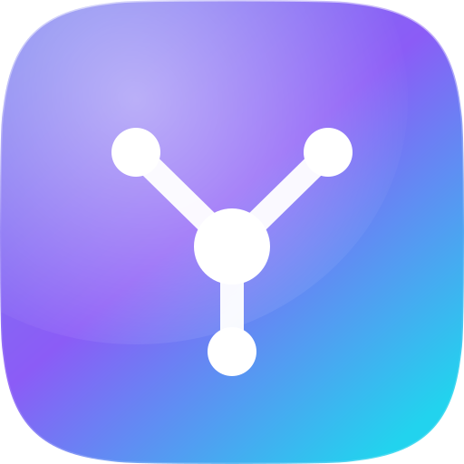

<div align="center">



# LlamaDesk

**A local-first launcher and workspace manager for your links, tools and project contexts.**

No account. No cloud. No telemetry. Your data never leaves your computer.

[](LICENSE)


</div>

---

## What it is

LlamaDesk is **not** a bookmark folder. It is a desktop workspace manager built around one
problem: when you work across many clients, projects and **environments**, opening the right
link in the *wrong* environment is expensive.

So LlamaDesk gives you a real hierarchy — profiles, projects, environments, contexts, groups,
applications and their links — plus a **Danger Zone** that makes it physically hard to open a
production URL by accident.

## Philosophy

| Principle | What it means in practice |
| --- | --- |
| **Local only** | One SQLite file in your user folder. That is the whole database. |
| **Zero cloud** | No sign-up, no sync, no backend, no remote database. |
| **Zero telemetry** | No analytics, no crash reporting, no update pings. The Rust dependency tree contains **no HTTP client at all** — `src-tauri/Cargo.lock` is the proof, and CI fails if one is ever added. |
| **Plug & play** | A single installer. No Node.js, no Python, no Docker, no database server. SQLite is compiled into the executable and the database is created on first launch. |
| **No hardcoded data** | The app starts empty. Every project, environment and link is yours. |
| **Calendars are just links** | No Google/Microsoft OAuth, no calendar API, no scraping. A calendar is a URL that opens in your browser. |

## Features

- **Hierarchy that matches reality** — Profile → Project / Workspace → Environment → Context →
  Group → Application → Links. One application can hold many links (Camunda → Admin, Tasklist, Operate).
- **Danger Zone** — Mark a link, an application, an environment or a whole project as
  `warning`, `danger` or `critical`. Protection cascades down the tree, and the nearest explicit
  override always wins, so a single link can opt out of its environment's protection (or opt in).
  `critical` requires typing a confirmation word. Confirmation dialogs are fully customisable,
  with `{environment}`, `{application}`, `{project}` and `{url}` placeholders.
- **Open All** — Open every link of a project, environment or context in your default browser
  with one click. Protected links are intercepted first and confirmed in a single dialog.
- **Command Palette** — `Ctrl + Space` from anywhere, even when the window is in the tray.
- **Environment Switcher** — Jump from `ACME / TEST / Client A` to the exact same place in
  another environment.
- **Dormant link detection** — Links you have not opened in months are flagged, computed purely
  from your local history. LlamaDesk never contacts an address to check it.
- **Favourites, drag & drop reordering, duplication** of entire subtrees (a whole environment
  with its applications and links, in one action).
- **Quick Workspaces** — Sets of links that open together even when they live in different
  projects: "Monday standup" can pull from one client's production, another's Jira and your mail.
  Temporary workspaces expire on their own.
- **Quick capture** — `Ctrl + Shift + L` from anywhere: the URL is read from your clipboard
  (only when you press the shortcut, never in the background), you give it a name and a
  destination, and it is saved.
- **Local notes and tags** on any item, saved as you type.
- **Backup and restore** — A JSON export of the whole configuration, shareable with a colleague.
  It contains no credentials (there are none) and no usage history. Import merges or replaces,
  and a copy of the database is taken before a replace.
- **Design** — Glass panels, squircles, spring physics. Dark, light or system. Custom wallpapers
  and a gallery of built-in gradients.

## Installation

Download the latest installer from [Releases](../../releases):

- `LlamaDesk_x.y.z_x64-setup.exe` — NSIS installer, **installs per user, no administrator rights needed**
- `LlamaDesk_x.y.z_x64_en-US.msi` — MSI package for managed deployment

Your data lives in `%APPDATA%\com.llamadesk.app\llamadesk.db` — **not** in the installation
folder, so it survives updates and reinstalls.

## Development

### Prerequisites

```powershell
# Rust toolchain
winget install --id Rustlang.Rustup -e

# MSVC C++ build tools (required by Rust on Windows)
winget install --id Microsoft.VisualStudio.2022.BuildTools -e `
  --override "--quiet --add Microsoft.VisualStudio.Workload.VCTools --includeRecommended"

# Node.js 20+
node --version
```

WebView2 is already present on Windows 11 and on up-to-date Windows 10.

### Running

```bash
npm install
npm run dev          # Tauri + Vite, hot reload on both sides
npm run dev:vite     # frontend only, in a browser (backend calls fall back to mocks)
```

### Quality gates

```bash
npm run typecheck              # TypeScript strict
npm run lint                   # ESLint
npm run test                   # Vitest
cd src-tauri && cargo test     # migrator, seeding, URL validation
cd src-tauri && cargo clippy --all-targets -- -D warnings
```

### Building installers

```bash
npm run build        # produces .exe (NSIS) and .msi in src-tauri/target/release/bundle/
npm run icons        # regenerates the icon set from the procedural logo
```

Tagging a commit with `v*` and pushing it triggers the release workflow, which builds both
installers and publishes them as a draft GitHub Release.

## Architecture

```
src/                    React 19 + TypeScript + Tailwind v4 + Framer Motion
├─ app/                 shell: router, layouts, providers
├─ components/ui/       UI kit (no domain logic)
├─ features/            vertical slices: projects, danger-zone, command-palette, …
├─ lib/                 motion system, IPC layer, i18n
└─ stores/              Zustand

src-tauri/              Rust + Tauri 2
├─ src/db/              connection, versioned migrations, first-run seeding
├─ src/domain/          serde structs shared with the frontend
├─ src/commands/        the API React can call — no SQL ever reaches the frontend
├─ src/services/        URL validation, danger resolution, backup, duplication
└─ src/tray.rs          system tray, global shortcut, window lifecycle
```

Two decisions worth knowing:

1. **The frontend never writes SQL.** It calls typed Tauri commands. Critical logic (Danger Zone
   resolution, migrations, URL validation, subtree duplication) lives in Rust where `cargo test`
   can reach it.
2. **The hierarchy is one table.** `containers` is an adjacency list with a `kind` discriminator,
   so reordering, moving, duplicating, breadcrumbs and danger inheritance are a single generic
   algorithm rather than seven parallel implementations. The allowed nesting rules live in the
   `allowed_child_kinds` table — data, not schema.

See [docs/ARCHITECTURE.md](docs/ARCHITECTURE.md) and [docs/DATA_MODEL.md](docs/DATA_MODEL.md).

## A note on glass

On Windows, `backdrop-filter: blur()` blurs only content *inside* the webview — it cannot sample
the desktop behind the window. The in-app wallpaper is therefore not decoration: it is the layer
that every glass panel samples. An experimental "system transparency" mode (native Acrylic) is
available in Settings for those who want the real see-through effect.

## Contributing

Issues and pull requests are welcome. Please read [CONTRIBUTING.md](CONTRIBUTING.md) first —
in particular the non-negotiable rules: no network calls, no telemetry, no hardcoded user data.

## License

[MIT](LICENSE) © LlamaDesk contributors
