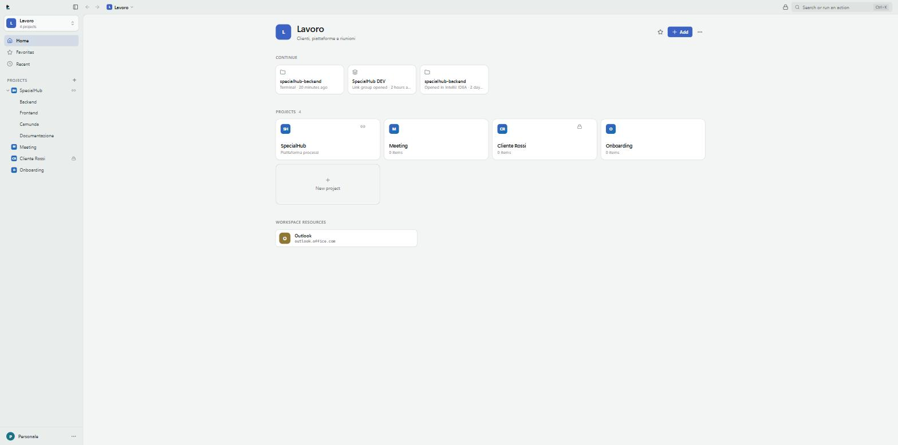
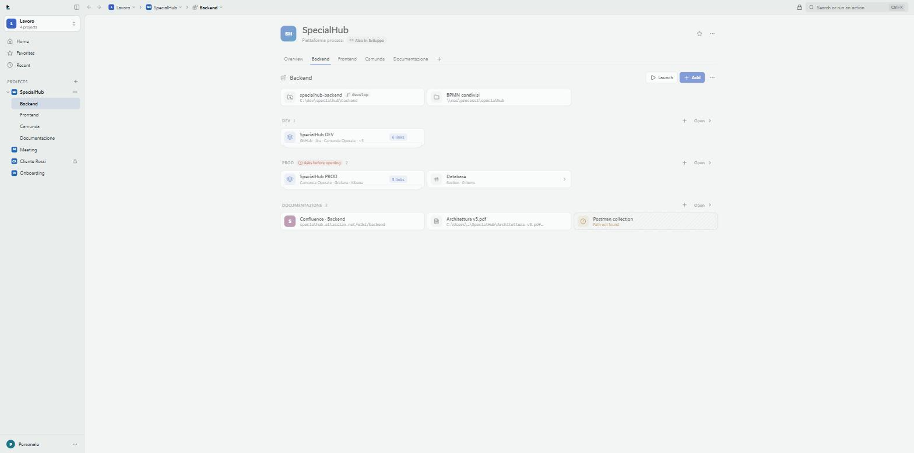
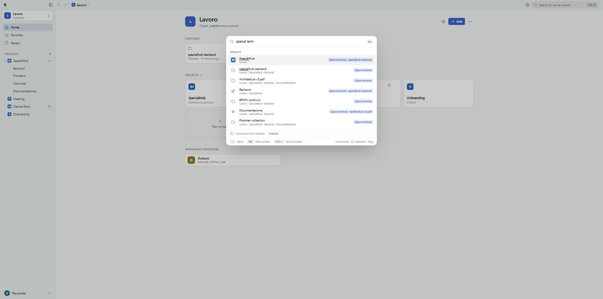

<div align="center">


# LlamaDesk

**A local-first launcher and workspace manager for your links, files, tools and project contexts.**

No account. No cloud. No telemetry. Your data never leaves your computer.

[](LICENSE)




</div>

---

## What it is

A day of work is spread across a repository, a Jira board, three Camunda consoles, a shared
folder and two browser profiles. LlamaDesk keeps those together — by project, not by kind — and
opens them the way you actually open them: this repository in **IntelliJ**, that group of links
in the **work profile of Chrome**, this folder in **Windows Terminal**.

It is not a bookmark folder and not a note-taking app. It is the place you open first in the
morning and the thing that opens everything else.

## Highlights

| | |
| --- | --- |
| **A hierarchy that matches reality** | Workspace → Project → Subproject → Sections, nested as deep as you want. A project can live in several workspaces at once — the same project, not a copy. |
| **Open with the right tool** | LlamaDesk finds your terminals, IDEs and browsers (including browser profiles) and remembers which one a project prefers. Subprojects and sections inherit that choice. |
| **Launch** | A project can define a sequence: open the repository in the IDE, then a terminal, then the DEV link group. One button. |
| **Ask before opening** | Mark anything "ask before opening" — a whole PROD section, or a single link. The confirmation is enforced in Rust, so it applies to clicks, the palette and Launch alike. |
| **Protection** | A per-profile lock password (Argon2id). While locked, protected items show only their name: no content, no search results, no recents, and the backend refuses to open them. |
| **Command palette** | `Ctrl+K`. Fuzzy search over names, aliases, tags, parent names, addresses and paths, ranked by what you actually use. Object + verb: `camunda term` opens a terminal in Camunda's repository. |
| **Local paths that tell the truth** | A path row shows what the disk says right now: file, folder, Git repository (with branch), missing, or unreachable network share. |
| **Two profiles, one library** | Profiles are lenses on the same library: each one chooses which workspaces it sees and keeps its own favorites, recents and appearance. |
| **Backups you can trust** | One daily automatic copy of the database (last seven kept), manual copies anywhere, and a restore that verifies the file and keeps the previous database next to it. |

<div align="center">

<br /><em>A project: subprojects as tabs, sections with their resources, Launch in the header.</em>
<br /><br />

<br /><em>The palette: "special term" proposes a terminal in the repository of SpecialHub.</em>
</div>

## Philosophy

| Principle | What it means in practice |
| --- | --- |
| **Local only** | One SQLite file in your user folder. That is the whole database. |
| **Zero cloud** | No sign-up, no sync, no backend, no remote database. |
| **Zero telemetry** | No analytics, no crash reporting, no update pings. The Rust dependency tree contains **no HTTP client at all** — `src-tauri/Cargo.lock` is the proof, and CI fails if one is ever added. |
| **Plug & play** | A single installer. No Node.js, no Python, no Docker, no database server. SQLite is compiled into the executable and the database is created on first launch. |
| **No hardcoded data** | The app starts empty. Every workspace, project and link is yours. |
| **Nothing runs behind your back** | The clipboard is read only when you press the capture shortcut. Paths are inspected only for what is on screen. `.exe`, `.bat` and `.ps1` files are never launched by "Open". |
| **Calendars are just links** | No Google/Microsoft OAuth, no calendar API, no scraping. A calendar is a URL that opens in your browser. |

## Installation

> **Beta.** The first public build is `0.0.1`. Expect rough edges, and keep a backup
> (Settings → Data) before updating.

Download the latest installer from [Releases](../../releases):

- `LlamaDesk_x.y.z_x64-setup.exe` — NSIS installer, **installs per user, no administrator rights needed**
- `LlamaDesk_x.y.z_x64_en-US.msi` — MSI package for managed deployment

Windows SmartScreen will warn you: the installer is not signed with a paid certificate yet.
Choose *More info → Run anyway* if you trust the source, or build it yourself (below).

Your data lives in `%APPDATA%\com.llamadesk.app\` — **not** in the installation folder, so it
survives updates and reinstalls:

```
llamadesk.db      the whole library
backups/          automatic and manual backups
covers/           cover images you chose
```

The app ships in **Italian and English** and follows your Windows language on first run.

## Development

### Prerequisites

```powershell
# Rust toolchain
winget install --id Rustlang.Rustup -e

# MSVC C++ build tools (required by Rust on Windows)
winget install --id Microsoft.VisualStudio.2022.BuildTools -e `
  --override "--quiet --add Microsoft.VisualStudio.Workload.VCTools --includeRecommended"

# Node.js 20+
node --version
```

WebView2 is already present on Windows 11 and on up-to-date Windows 10.

### Running

```bash
npm install
npm run dev          # Tauri + Vite, hot reload on both sides
npm run dev:vite     # frontend only, in a browser, with an in-memory mock backend
```

The browser preview is useful for UI work: it starts with the example library used in the
screenshots. `?vuoto` starts empty, `?tema=scuro|chiaro` forces a theme, and the preview lock
password is `llama`.

### Quality gates

```bash
npm run lint && npm run typecheck && npm run test    # ESLint, TypeScript strict, Vitest + SQL check
cd src-tauri && cargo fmt --check && cargo clippy --all-targets -- -D warnings && cargo test
```

`cargo test` also regenerates the TypeScript types in `src/types/generated` from the Rust
structs; CI fails if they are not committed.

### Building installers

```bash
npm run build        # .exe (NSIS) and .msi in src-tauri/target/release/bundle/
npm run icons        # regenerates the whole icon set from src/components/brand/geometry.json
```

Pushing a `v*` tag triggers the release workflow, which builds both installers and publishes a
draft GitHub Release. See [docs/RELEASE.md](docs/RELEASE.md).

## Architecture

```
src/                    React 19 + TypeScript + Tailwind v4 + Framer Motion
├─ app/                 shell: router, title bar, sidebar, opener animation
├─ components/          UI kit and shared pieces (no domain logic)
├─ features/            vertical slices: workspace, project, actions, launch,
│                       palette, protection, inspector, settings
├─ lib/                 IPC layer, queries, motion, search helpers, i18n
└─ stores/              Zustand (session, ui, dialogs, palette, lock)

src-tauri/              Rust + Tauri 2
├─ src/db/              connection, versioned migrations, repositories
├─ src/domain/          serde structs shared with the frontend (ts-rs)
├─ src/commands/        the API React can call — no SQL ever reaches the frontend
└─ src/services/        hierarchy, inheritance, actions, tools, search,
                        protection, launch, backup, assets, paths
```

Three decisions worth knowing:

1. **The frontend never writes SQL.** It calls typed Tauri commands. Everything that must not be
   bypassed — nesting rules, inherited protection and confirmation, tool resolution, URL
   validation, the lock — lives in Rust where `cargo test` can reach it.
2. **The hierarchy is one table.** `nodes` is an adjacency list with a `kind` discriminator and
   `edges` carries order and pinning, so moving, sharing, duplicating, breadcrumbs and
   inheritance are one generic algorithm. The nesting rules live in `allowed_children` — data,
   not schema.
3. **Programs are started with arguments, never a shell string**, and only from a detected or
   explicitly added tool.

More: [docs/ARCHITECTURE.md](docs/ARCHITECTURE.md) · [docs/DATA_MODEL.md](docs/DATA_MODEL.md) ·
[docs/BRAND.md](docs/BRAND.md) · [docs/CHECKLIST.md](docs/CHECKLIST.md) ·
[docs/REDESIGN.md](docs/REDESIGN.md) (the 2.0 design record, in Italian).

## Contributing

Issues and pull requests are welcome. Please read [CONTRIBUTING.md](CONTRIBUTING.md) first — in
particular the non-negotiable rules: no network calls, no telemetry, no hardcoded user data.
Security reports go through [SECURITY.md](SECURITY.md).

## License

[MIT](LICENSE) © LlamaDesk contributors
