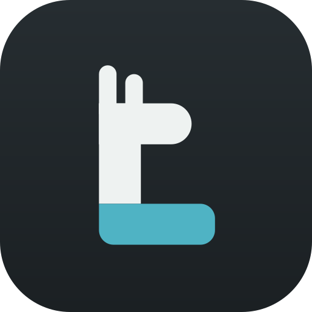

# Marchio LlamaDesk

Concept **C — "Collo a L"** (decisione D10, `docs/REDESIGN.md` § 11).

Una L maiuscola: l'asta è il collo di una llama, in cima testa e orecchie, il piede è la
scrivania. Dice il nome (L di LlamaDesk), l'animale e il luogo di lavoro con tre forme.

## Fonte unica

`src/components/brand/geometry.json` descrive il simbolo su una griglia 512 come rettangoli
con raggi per angolo. Da lì:

| Uso | Dove |
|---|---|
| Interfaccia (barra del titolo, benvenuto) | `BrandMark`, `Wordmark`, `Logo` in `src/components/brand/BrandMark.tsx` |
| Animazione di apertura | `src/app/Opener.tsx` (anima le singole parti) |
| Icone di Windows (`.ico` 16–256, PNG) | `npm run icons` → `scripts/brand.mjs` + `tauri icon` |
| File vettoriali | `docs/brand/*.svg`, generati dallo stesso script |

Cambiare il simbolo significa cambiare `geometry.json` e rilanciare `npm run icons`.

## Sistema

| Variante | File | Quando |
|---|---|---|
| Icona dell'app | `brand/app-icon.svg` | Installer, barra delle applicazioni, Start |
| Simbolo | `brand/symbol.svg` | Su fondi chiari, ≥ 32 px |
| Simbolo scuro | `brand/symbol-dark.svg` | Su fondi scuri |
| Simbolo piccolo | `brand/symbol-small.svg` | Fino a 32 px: orecchie unite da una tacca |
| Monocromatico | `brand/symbol-mono.svg` | Stampa, incisioni, sovrapposizioni |
| Logo completo | `brand/logo-light.svg`, `brand/logo-dark.svg` | Documenti, sito, schermate |

Il wordmark è "LlamaDesk" in Segoe UI Variable Display semibold, spaziatura −2%, nel colore
dell'inchiostro: il colore del marchio vive solo nella scrivania.

## Colori

| Ruolo | Chiaro | Scuro | Su tessera |
|---|---|---|---|
| Inchiostro | `#14191B` | `#E6EBEA` | `#EEF2F1` |
| Titicaca (scrivania) | `#1D7384` | `#5BB6C6` | `#4FB3C4` |
| Tessera grafite | — | — | `#262D31` → `#1B2023` |

Dentro l'app l'accento è quello del workspace: Titicaca compare nel simbolo e durante
l'apertura, poi sfuma nel colore del workspace.

## Regole

- Tessera: raggio 22,5% del lato; simbolo all'80% (94% fino a 32 px).
- Area di rispetto: metà della larghezza del collo su ogni lato.
- Non ruotare, non inclinare, non separare la scrivania dal collo, non cambiare il colore della
  scrivania con l'accento di un workspace.
- Sotto i 16 px usare solo la tessera, mai il simbolo nudo.

## Apertura

Solo all'avvio a freddo, se "Animazione di apertura" è attiva, la finestra non parte nella tray
e il sistema non chiede di ridurre il movimento. La finestra compare solo dopo il primo
fotogramma dipinto (`window_ready`), quindi senza lampi; se il frontend non risponde entro
3 secondi la mostra Rust.

| Tempo | Cosa succede |
|---|---|
| 0–220 ms | La scrivania si stende da sinistra |
| 120–380 ms | Il collo si alza |
| 300–520 ms | La testa esce dal collo, poi le due orecchie |
| 420–640 ms | Compare il nome |
| 650–950 ms | Il nome sparisce, il simbolo vola verso la barra del titolo, il fondo dissolve e l'accento passa da Titicaca al colore del workspace |

La shell si carica sotto nel frattempo: l'animazione non allunga l'avvio. Dalla palette,
`> Rivedi l'animazione di apertura`.
