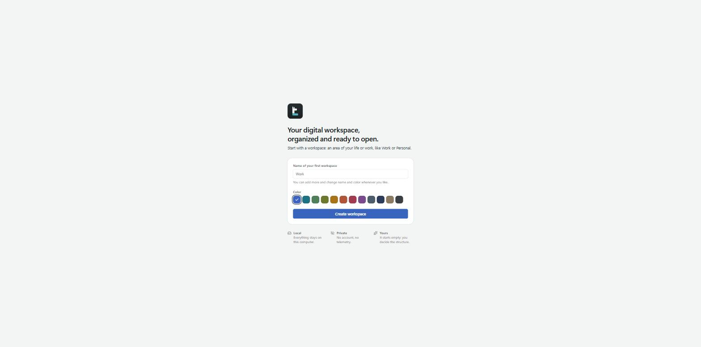

# Getting started

Ten minutes, from an empty app to a project you can open with one click.

## 1. Create your first workspace

The first launch asks for one thing: the name of a workspace. A workspace is an area of your life
or work — *Work*, *Personal*, *Studies*. Pick a colour: it becomes the accent you see while you
are inside it.

You can add more workspaces later, and rename or recolour any of them.

## 2. Create a project

A project is the thing you actually work on: a client, a product, a course. On the workspace home,
use **Add** → *New project*, or the `+` next to PROJECTS in the sidebar.

Projects can be split further into **subprojects** (Backend, Frontend, Documentation…), which
appear as tabs on the project page.

## 3. Put things in it

Inside a project, subproject or section, press **Add** (or `Ctrl+N`) and paste what you have.
LlamaDesk recognises it:

| What you paste | What it becomes |
| --- | --- |
| `https://…` | a link |
| Several addresses, one per line | a **link group** that opens with one click, or separate links |
| `C:\dev\project` or `\\server\share` | a local path (folder, file, repository or network share) |
| A plain name, like `Documentation` | a section, or a subproject |

You can also drag files and folders from File Explorer straight onto a project or a section.

## 4. Organise with sections

Sections group things inside a project: `DEV`, `PROD`, `Documentation`, `Meeting notes`. They can
be nested as deep as you like, and "Open" on a section header gives it the whole page.

## 5. Open things

Click a row and it opens the way it should:

- a link → your default browser;
- a link group → all its enabled links, one after another;
- a folder → File Explorer;
- a Git repository → your preferred IDE;
- a file → the program Windows associates with it.

Hover a row for the quick buttons, or right-click for every action: open with another browser,
open a terminal in that folder, show it in File Explorer, open the remote repository.

The first time you use a tool, LlamaDesk uses the first one it found on your PC. To decide, open
**Settings › Tools** or set a preferred tool on a single project from the details panel.

## 6. Search instead of navigating

Press `Ctrl+K` anywhere. Type a few letters of a name, a tag, a parent's name or a domain.

Add a verb to do something: `camunda term` opens a terminal in Camunda's repository,
`portal cursor` opens that repository in Cursor.

## 7. Two things worth setting up early

- **Ask before opening** — on a `PROD` section or a delicate link, open the details panel
  (`Space` on a row, or `Ctrl+I` for the page) and turn on *Ask before opening*. Everything
  inside it inherits the setting.
- **A backup** — Settings › Data and backups. One backup is taken automatically every day; make a
  manual one before you experiment.

## Where to go next

- [User guide](USER_GUIDE.md) — every screen and feature in detail
- [Configuration](CONFIGURATION.md) — settings, tools, shortcuts, files on disk
- [Troubleshooting](TROUBLESHOOTING.md) — when something does not open
