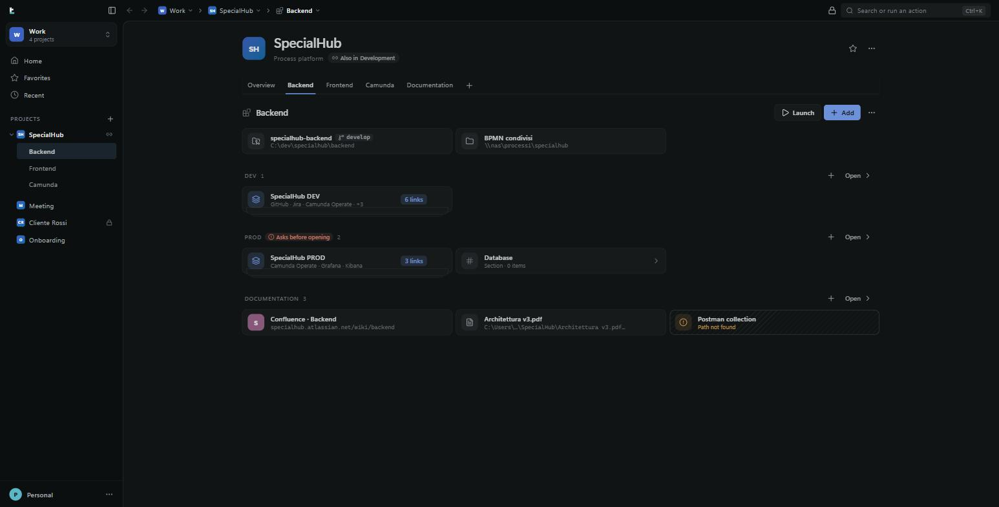

# User guide

This guide describes every screen and feature of LlamaDesk 0.0.1. Screenshots come from the
example library used in the browser preview.

- [The window](#the-window)
- [Library: workspaces, projects, sections](#library-workspaces-projects-sections)
- [Adding things](#adding-things)
- [Opening things](#opening-things)
- [Launch: a sequence of actions](#launch-a-sequence-of-actions)
- [The details panel](#the-details-panel)
- [Search and the command palette](#search-and-the-command-palette)
- [Favorites and recents](#favorites-and-recents)
- [Ask before opening](#ask-before-opening)
- [Protection and the lock](#protection-and-the-lock)
- [Profiles](#profiles)
- [The tray and quick capture](#the-tray-and-quick-capture)
- [Keyboard shortcuts](#keyboard-shortcuts)

## The window


LlamaDesk draws its own title bar. From left to right it holds the symbol, the button that
collapses the sidebar (`Ctrl+B`), back and forward, the path of the page you are on, the lock
button (only once a password exists), the search field (`Ctrl+K`) and the Windows buttons.

Each step of the path has a small arrow: it lists the things next to that one, so you can jump
sideways without going back.

The sidebar holds the workspace switcher, **Home**, **Favorites**, **Recent**, then the projects
of the current workspace with their subprojects, and the profile menu at the bottom. It never
shows sections or single links: it is there to orient you, not to browse files.

The window remembers its size and position. Below 900 px the sidebar collapses by itself; below
1200 px the details panel opens over the page instead of narrowing it.

Light, dark or "follow the system" — Settings › Appearance. On Windows 11 the title bar and the
sidebar show the system's Mica material.



## Library: workspaces, projects, sections

```
Workspace            Work, Personal, Studies — an area of your life
└─ Project           SpecialHub, Client Rossi — what you work on
   ├─ Subproject     Backend, Frontend — a part of the project (tabs)
   └─ Section        DEV, PROD, Documentation — grouping, nestable
      └─ Links, link groups, local paths
```

Sections can also live directly inside a workspace, and inside other sections, as deep as you
want. Nothing forces you to use every level.

**Workspace home** answers three questions: *what was I doing?* (**Continue**, the last things
you opened, which repeat with one click), *where can I go?* (**Projects**, pinned ones first),
*what do I use most?* (**Favorites in this workspace**). Loose links and sections of the workspace
follow below.

**A project page** shows its name and description, a tab per subproject, then the content of the
scope you are in: subproject cards, resources, and sections with their rows.

A project can belong to **several workspaces at once** — the same project, not a copy. The header
says "Also in …" and the sidebar marks it with a link icon. Changes made in one workspace are
visible in the other; removing it from one workspace leaves it in the others.

The `⋯` menu of a page lets you create things inside it, set a workspace as the one that opens at
startup, remove a shared project from the current workspace, or delete the item. Deleting shows
what goes with it and can be undone from the toast (until the app restarts).

Rows can be dragged to reorder them, dropped on a section header to move them there, or moved
with `Alt+↑` / `Alt+↓`.

## Adding things

**Add** (`Ctrl+N`) opens one dialog for everything. Paste or type, and LlamaDesk recognises what
you gave it:

| Input | Result |
| --- | --- |
| One web address | A link, named after the site (you can rename it) |
| Several addresses | A **link group** that opens together, or separate links — you choose |
| A path like `C:\dev\app`, `%USERPROFILE%\Documents`, `\\server\share` | A local path |
| Several paths | Several path rows |
| A plain name | A section or a subproject |

The dialog also offers **Browse…** for a file or a folder, and a destination picker so you can
drop the new item in the scope you are looking at or in one of its sections.

You can also drag files and folders from File Explorer onto a project, subproject or section.

A path row shows what the disk says right now: file (with size), folder, Git repository (with the
current branch), network share, **not found** or **unreachable**. When a path is missing, the row
offers **Locate…** to point it at the new location. `F5` re-checks every path on the page.

## Opening things

A single click opens the row the obvious way:

| Row | Click does |
| --- | --- |
| Link | Opens it in the default browser |
| Link group | Opens every enabled link, spaced out so the browser keeps them all |
| Folder | Opens File Explorer |
| Git repository | Opens your preferred IDE |
| File | Opens it with the program Windows associates with it |
| Section | Opens the section page |

Hovering a row reveals quick buttons, and the right-click menu holds everything:

- **Open**, and **Open with ▸** for another IDE or browser;
- **Open terminal** in that folder (or in the file's folder), with the terminal you prefer;
- **Show in File Explorer**;
- **Open remote repository** — reads `origin` from the repository and opens its web page;
- **Copy address** / **Copy path**;
- **Add to launch ▸** (see below);
- **Edit…** (details panel), favourite, delete.

`Enter` opens the selected row, `Space` opens its details panel, and the arrow keys move between
rows, including across two columns.

**Tools.** LlamaDesk looks for the programs you already have: Windows Terminal, PowerShell 7,
Windows PowerShell, Command Prompt, Git Bash, WSL, VS Code, Cursor, Zed, Sublime Text,
Notepad++, JetBrains IDEs, Visual Studio, Chrome, Edge, Firefox, Brave — including browser
profiles. A project can prefer a specific IDE, terminal or browser, and everything inside it
inherits that choice unless it says otherwise.

**Links can be opened in a specific browser**, in a specific browser profile, and in a new
window: choose them in the details panel of a link or a group. When nothing is chosen, the link
goes to the Windows default browser.

For safety, "Open" never launches programs: `.exe`, `.bat`, `.cmd`, `.ps1`, `.msi`, `.lnk` and
similar files are refused with an explanation — you can still show them in File Explorer.

## Launch: a sequence of actions

A project, subproject or section can define a **Launch**: the actions you always do together.

1. Right-click a row → **Add to "<name>" launch** and pick the action.
2. Repeat for the other pieces: the repository in the IDE, a terminal, the DEV link group.
3. Reorder or remove steps in the details panel of the container.
4. Press **Launch** in the header.

Steps run in order, spaced out like a link group. A step that cannot run — a path that moved, a
tool that was uninstalled — does not stop the others; the summary at the end names it.

## The details panel

`Space` on a row, `Ctrl+I` for the current page, or **Edit…** from a menu. It is the only place
where things are changed; pages stay for using them.


Depending on what you selected, it holds:

| Section | Where it appears | What it does |
| --- | --- | --- |
| **General** | Everything | Name, address or path, description, aliases (extra words for search) |
| **Links** | Link groups | Switch single links off without deleting them, reorder, add, remove |
| **Opening** | Links and groups | Browser, browser profile, open in a new window |
| **Tools** | Containers and paths | Preferred IDE, terminal and browser, inherited by everything inside |
| **Appearance** | Workspaces, projects, subprojects, sections | Colour, icon (104 icons, searchable), cover image with a focal point (workspaces and projects) |
| **Tags** | Everything | Free tags, shared across the library and searchable |
| **Launch** | Projects, subprojects, sections | The steps, their order, removal |
| **Protection** | Everything | "Protect": hides the content while LlamaDesk is locked |
| **Ask before opening** | Everything | Inherit / no / confirm / type the name |
| **Workspaces** | Projects | Link the project to another workspace, remove it from one, pin it to a workspace home |
| **Delete** | Everything | With a summary of what goes with it |

Changes are saved when you leave a field: there is no Save button.

## Search and the command palette

`Ctrl+K` opens the palette. The global shortcut (`Ctrl+Alt+Space` by default) does the same from
any other application, bringing the window forward.


- **Empty**: the last actions you ran, ready to repeat, plus a few commands.
- **Typing**: it searches names, aliases, tags, the names of the containers something is in,
  addresses and paths. Accents and capitals do not matter, and matching letters are underlined.
  Results are ranked by how often and how recently you open things, with a nudge towards the
  workspace you are in.
- **Object + verb**: end your query with `term`, `ide`, `explorer`, `remote` or the name of a tool
  (`cursor`, `chrome`, `idea`) and the result carries that action. On a container, the action
  applies to the first path inside it.
- **Prefixes**: `>` shows only app commands, `@` only containers, `#tag` filters by tag.

Keys inside the palette: `↑`/`↓` to move, `Enter` to run, `Tab` for every other action of the
selected item (including each installed tool), `Ctrl+Enter` to go to where it lives, `Esc` to
close.

The commands (`>`) cover: add to this page, new project, new workspace, new profile, edit this
page, go to Home / Favorites / Recent / Settings, show or hide the sidebar, light / dark / system
theme, compact or comfortable density, search for tools again, re-check paths, and replay the
opening animation.

## Favorites and recents

**Favorites** (`Ctrl+D` on the current page or the selected row, or the star in a header) gives
you a page per workspace, with a switch to show the favorites of every workspace instead.

**Recent** lists what you opened, most recent first, with the tool used. Clicking an entry
repeats exactly the same action.

Both pages are per profile.

## Ask before opening

Anything can be marked "ask before opening", with two levels:

- **Confirm** — a dialog with what is about to open;
- **Type the name** — the same dialog, but the button stays disabled until you type the item's
  name.

The setting is inherited: put it on a `PROD` section and everything inside it asks, unless a
single item says otherwise. The rule is enforced in the backend, so it applies to clicks, the
palette, Launch and repeated recent actions alike.

## Protection and the lock


Turn on **Protect** in the details panel. The first time, LlamaDesk asks you to create a lock
password for the profile.

While the session is locked:

- protected items keep only their name and a padlock — no address, path, description or content;
- they disappear from search, Recent and Favorites, and a line says how many are hidden;
- opening, editing, moving or deleting them is refused;
- the page shows an unlock panel instead of the content, and the rest of the app keeps working.

It locks when you press `Ctrl+L` or the padlock in the title bar, when the window closes to the
notification area, when you switch profile, when the app restarts, and after the idle time set in
Settings (10 minutes by default, or never).

After three wrong passwords there is a growing wait, shown as a countdown. **Forgot password?**
removes the password *and* the protection from everything the profile sees, with a warning that
says how many items that is.

> The lock is a privacy lock, not encryption: the database file itself is readable by anything
> running as your Windows user. See [Privacy and data](PRIVACY.md).

## Profiles

A profile is a **lens on one library**, not a separate account. Each profile chooses which
workspaces it sees and keeps its own favorites, recent list, appearance and lock password. The
library itself is shared: a workspace hidden in one profile still exists for the others.

A profile has a name, an avatar (an icon of your choice, or the initials of the name) and a
colour, shown in the sidebar and in the switcher. The first profile is set up on the first
launch, together with the language of the interface.

Switch or create profiles from the workspace switcher or the profile menu at the bottom of the
sidebar. Settings › Profiles handles renaming, avatar, colour, which workspaces the active
profile sees, and deleting a profile (showing what would be deleted with it).

## The tray and quick capture

Closing the window hides LlamaDesk in the notification area (you can turn that off in Settings).
The tray icon menu has **Open LlamaDesk**, **Quick search**, **Settings** and **Quit**.

**Quick capture** (`Ctrl+Shift+L` by default) reads the address you copied and opens the Add
dialog with it already filled in, in the page you have open or in the current workspace. The
clipboard is read only at that moment, never in the background.

## Keyboard shortcuts

| Keys | Action |
| --- | --- |
| `Ctrl+K` | Search or run an action |
| `Ctrl+N` | Add to this page |
| `Ctrl+I` | Details panel of the page |
| `Ctrl+D` | Favourite |
| `Ctrl+B` | Show or hide the sidebar |
| `Ctrl+L` | Lock or unlock |
| `Ctrl+,` | Settings |
| `Ctrl+1`…`Ctrl+9` | Go to the *n*-th workspace |
| `Alt+←` / `Alt+→` | Back and forward (also the side buttons of the mouse) |
| `Enter` | Open the selected row |
| `Space` | Details of the selected row |
| `↑` `↓` `←` `→` | Move between rows and cards |
| `Alt+↑` / `Alt+↓` | Move the selected row |
| `F5` | Re-check the paths on the page |
| `Esc` | Close the panel, the dialog or the palette |
| `Ctrl+Alt+Space` | Search from any application (configurable) |
| `Ctrl+Shift+L` | Quick capture from the clipboard (configurable) |
